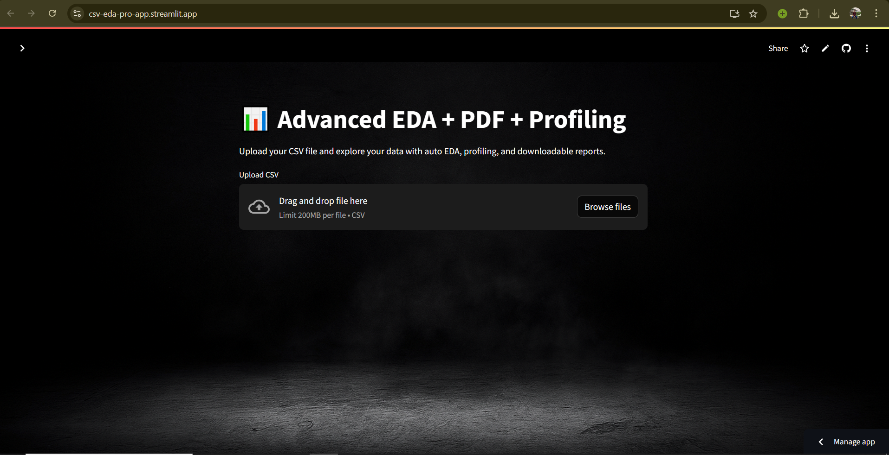
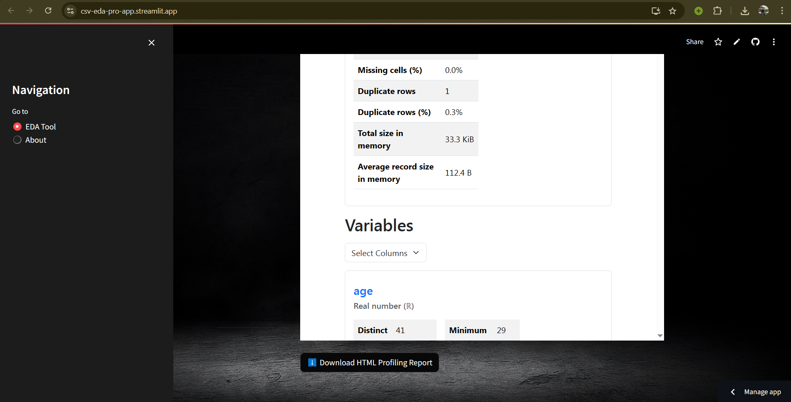
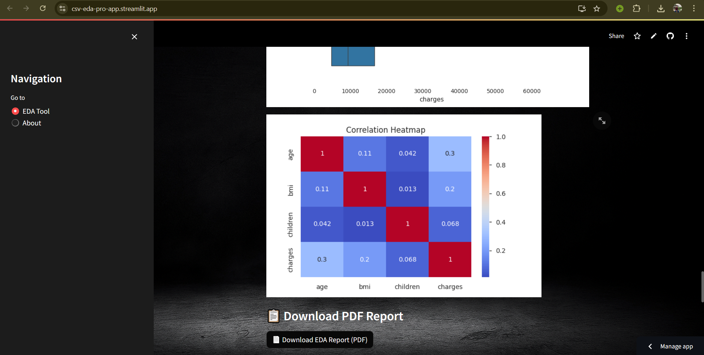

# csv-eda-pro-streamlit
# 📊 CSV EDA Pro — Streamlit Web App

An AI-powered Exploratory Data Analysis (EDA) tool built with **Streamlit** that allows you to:

- Upload CSV files
- Perform automatic data analysis
- Visualize insights (distributions, correlations, outliers)
- Generate interactive profiling reports
- Export results as a **PDF** and **HTML** report

🚀 **Live App**: [Try on Streamlit Cloud](https://csv-eda-pro-app.streamlit.app/)

---

## 🧰 Features

- ✅ Upload and preview CSV data
- 📊 Descriptive statistics (mean, std, etc.)
- 📉 Visualizations (histograms, boxplots, heatmaps)
- 🧼 Missing values and duplicate detection
- 📄 **Generate PDF report** with key visuals
- 📑 **Automated profiling** using `ydata-profiling`
- 🌄 Custom background and clean UI

---

## 📸 Screenshots

| Home Page | Profiling Report | PDF Download |
|-----------|------------------|---------------|
|  |  |  |

---

## 📦 Requirements

Install dependencies using:

```bash
pip install -r requirements.txt

✅Key Libraries
streamlit

pandas, numpy

seaborn, matplotlib, altair

ydata-profiling

reportlab (for PDF)

Pillow (for image support)

📂 Folder Structure
Copy
Edit
csv-eda-pro-streamlit/
├── app/
│   └── app.py
├── images/
│   ├── background_image.jpg
│   └── rayhan.jpg
├── profiling_report.html
├── LICENSE
└── README.md

🧠 About the Creator
👨‍💻 Rayhan Mahmud Ansari
🎓 CSE, Sylhet Engineering College
📧 rayhan_mahmud@sec.ac.bd
🔗 LinkedIn | GitHub

📃 License
This project is open-source and available under the [MIT License](LICENSE).


🙌 Acknowledgements

- [Streamlit](https://streamlit.io/) — for the web app framework
- [YData Profiling](https://github.com/ydataai/ydata-profiling) — for automated EDA reports
- [ReportLab](https://www.reportlab.com/) — for PDF report generation
